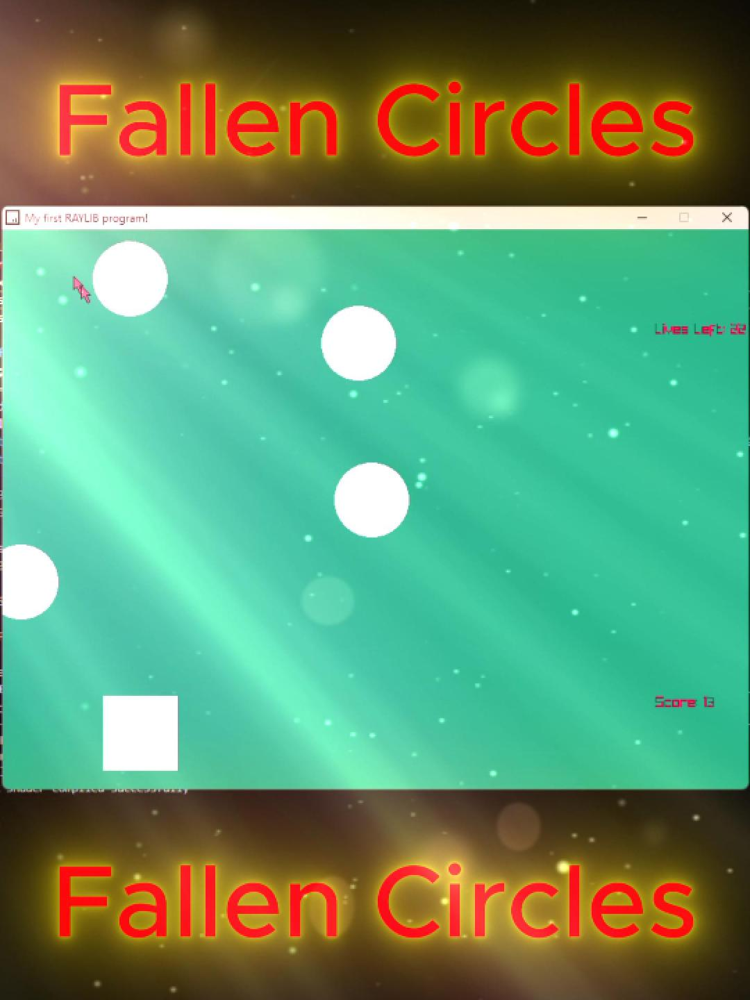

# Raylib-CPP-Starter-Template-for-VSCODE-V2
Raylib C++ Starter Template for Visual Studio Code on Windows.
This is a game where you try to hit as many circles as possible before you die!

# How to use this template
Right-Click on main.exe
Go to properties
Check Unblock
Then click Apply
Then Left click main.exe

# Video Tutorial

  

🎥 <a href="https://youtube.com/shorts/rnisgpiasqk" target="blank">Video Showcase on YouTube</a>

 
 

| 📺 <a href="https://www.youtube.com/@ArmanCoding/">My YouTube Channel</a>

